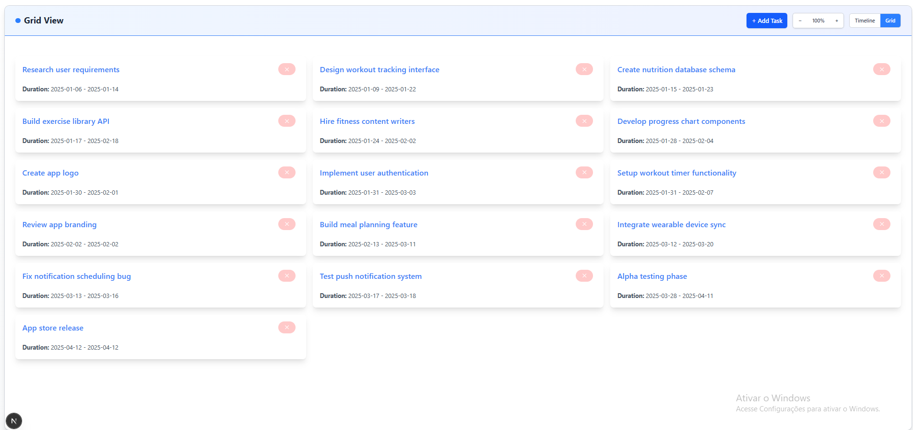
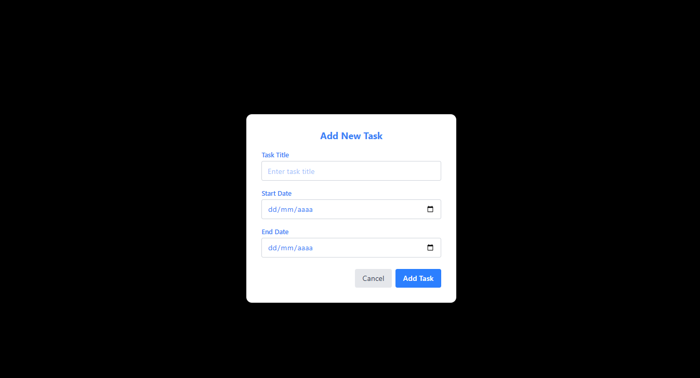

# 📅 Timeline Board

A modern task management system with timeline visualization and drag-and-drop functionality. Perfect for project planning and task organization.

[](https://nextjs.org/)
[](https://www.typescriptlang.org/)
[](https://tailwindcss.com/)
[](https://github.com/pmndrs/zustand)

## ✨ Features

- **📋 Task Management** - Create, edit, and organize tasks with ease
- **📅 Timeline View** - Visualize tasks in a horizontal timeline
- **⚡ Drag & Drop** - Reposition tasks intuitively
- **🔍 Dual Views** - Switch between Grid and Timeline layouts
- **📱 Responsive** - Works on desktop and mobile
- **⚠️ Error Handling** - Robust error boundaries for stability

## � Screenshots

### Timeline View


### Grid View



### Modal View



---

## �🛠️ Tech Stack

- **Next.js 15** - React framework
- **TypeScript** - Type safety
- **Tailwind CSS** - Styling
- **Zustand** - State management

## 🚀 Getting Started

1. **Clone and install:**

   ```bash
   git clone https://github.com/venturelli-91/timeline_board.git
   cd timeline_board/frontend
   npm install
   ```

2. **Run development server:**

   ```bash
   npm run dev
   ```

3. **Open browser:**
   Navigate to [http://localhost:3000](http://localhost:3000)

## 📸 Screenshots

_Add screenshots of your timeline board in action_

## 🏗️ Project Structure

```
frontend/
├── app/
│   ├── src/
│   │   ├── components/     # React components
│   │   ├── store/         # Zustand stores
│   │   ├── types/         # TypeScript definitions
│   │   └── data/          # Sample data
│   └── globals.css
└── package.json
```

## 🤝 Contributing

1. Fork the repository
2. Create your feature branch (`git checkout -b feature/AmazingFeature`)
3. Commit your changes (`git commit -m 'Add some AmazingFeature'`)
4. Push to the branch (`git push origin feature/AmazingFeature`)
5. Open a Pull Request

## 📄 License

This project is licensed under the MIT License - see the [LICENSE](LICENSE) file for details.

---
